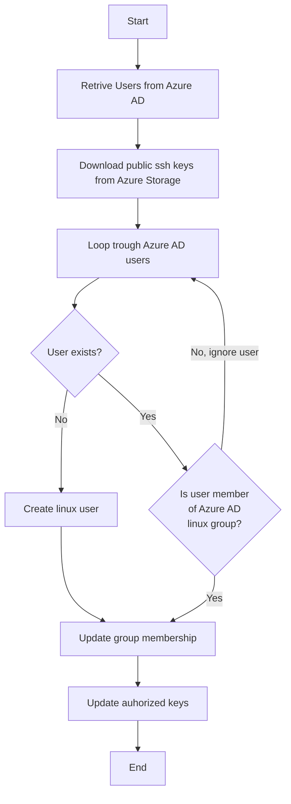

# azure-ad-user-to-linux

This script allows "syncing" of Azure AD users to linux.
The goal is to have a simply user sync without the need to join your linux systems to Azure AD or change
the AD user schema.


## Overview

The script is executed as cronjob on the linux server:

1) It retrieves all users who are members of one or more AD groups
2) It retrieves public ssh keys from a storage account blob for each of the users
3) It verifies synced users against linux by checking linux group membership
   1) if the AD user does not exist on the linux server create it
      1) create user, 
      2) add user to groups, 
      3) add public ssh key to users authorized keys file
   2) if the AD user exists on the linux server but isnt member of linux group ignore it
   3) if the AD user is disabled but exists on the linux server disable it on the linux server
 

  
## Requirements
 
- Administrative rights in Azure 
- (optional) azure cli installed - the cli is used to create the application registration etc. Alternatively, the preparation steps can be executed via the Azure webinterface.

## Preparation in Azure

The following steps need to be executed in Azure to make the script ready for use.

### Create a resource group

```bash
# make sure we are working in the correct subscription
az account set --subscription mysubscription
# create a resource group for the storage account
az group create --location switzerlandnorth --name azure-ad-user-to-linux
```

### Create a storage account

The storage account will store the users public keys.

```bash
# create a storage account for the ssh public keys
az storage account create --resource-group azure-ad-user-to-linux --name aadusertolinuxconfig
# create a container to upload and download the ssh keys from
az storage container create --account-name aadusertolinuxconfig --name ssh-keys
```

### Create an Application Registration

```bash
# create a service principal (application registration) with read access to the storage account
# and a password valid for the next 100 years
az ad sp create-for-rbac \
    --name "azure-ad-user-to-linux" \
    --years 100 \
    --role "Storage Blob Data Reader" \
    --scopes "/subscriptions/mysubscription/resourceGroups/azure-ad-user-to-linux/providers/Microsoft.Storage/storageAccounts/aadusertolinuxconfig"
```

The command will print a json output. Please store the appId (username) and the password somewhere safe.
You won't be able to retrieve the password afterwards!

```json
{
  "appId": "7307b99d-b5a2-4ee7-b947-2fe8944baccf",
  "displayName": "azure-ad-user-to-linux",
  "name": "7307b99d-b5a2-4ee7-b947-2fe8944baccf",
  "password": "... snip ...",
  "tenant": "mytenant"
}
```

Next, we need to grant the service principal access to the Azure AD graph.
The service principal requires 'User.Read.All' and 'Group.Read.All' permissions for Azure Graph.

```bash
# add user.read.all permissions
# --api: the id of the azure graph api
# --api-permission: the id of the user.read.all permission, the =Role at the end allows application permissions. 
# --id: the id of the application created in the last step
az ad app permission add \
    --api 00000003-0000-0000-c000-000000000000 \
    --api-permission df021288-bdef-4463-88db-98f22de89214=Role \
    --id 7307b99d-b5a2-4ee7-b947-2fe8944baccf
    
# add group.read.all permissions
az ad app permission add \
    --api 00000003-0000-0000-c000-000000000000 \
    --api-permission 5b567255-7703-4780-807c-7be8301ae99b=Role \
    --id 7307b99d-b5a2-4ee7-b947-2fe8944baccf

# grant admin consent for the permissions
az ad app permission admin-consent --id 7307b99d-b5a2-4ee7-b947-2fe8944baccf

```

The application needs admin consent for the permissions as it is running as "application" and not on behalf of a 
logged in user.

### Prepare ssh public keys
- generate public key
- upload key to storage account container in format [prefix][userPrincipalName][.identifier][suffix]

#### Example public key file names

When running with the default script configuration there is no `prefix` set and the suffix is set to `.pub`.
Valid public key files for the user with the userPrincipalName `seh@foryouandyourcustomers.com` are:
- seh@foryouandyourcustomers.com.pub
- seh@foryouandyourcustomers.com.secondkey.pub
- seh@foryouandyourcustomers.com.YETANOTHERKEY.pub

## Installation

To install this script clone the repository and link the systemd files.

```bash
# first, clone the repository
cd /usr/local
sudo git clone https://github.com/foryouandyourcustomers/azure-ad-users-to-linux.git

# navigate to the cloned repository and create the python virtual environment
cd /usr/local/azure-ad-users-to-linux
sudo python3 -m venv venv
sudo ./venv/bin/pip install --upgrade pip
sudo ./venv/bin/pip install -r requirements.txt 

# next copy the example configuration file. the configuration file contains the client id and secret and should 
# therefore only be accessible by the root user
cd /usr/local/azure-ad-users-to-linux
sudp cp ./configuration.env.example ./configuration.env
sudo chmod 600 ./configuration.env

# now prepare the configuration file
# add the service principal tenant, client id and secret
# add the azure ad user group object ids
# add the storage account and container names
# (optional) add additional linux user groups the managed users should be added too (e.g. docker, wheel, ...)
sudo vim ./configuration.env

# next install the systemd service
sudo systemctl link /usr/local/azure-ad-users-to-linux/azure-ad-users-to-linux.service
sudo systemctl daemon-reload
sudo systemctl enable azure-ad-users-to-linux
sudo systemctl start azure-ad-users-to-linux
```

## Usage

The python script uses environment variables or command line options for it's configuration.

```bash
$ ./azure-ad-users-to-linux.py --help
Usage: azure-ad-users-to-linux.py [OPTIONS]

  synchronize azure ad users with local user accounts

Options:
  --loglevel [CRITICAL|ERROR|WARNING|INFO|DEBUG]
                                  The loglevel for the script execution
                                  [default: INFO]
  --tenant-id TEXT                The azure tenant id  [required]
  --client-id TEXT                The azure service principal client id
                                  [required]
  --client-secret TEXT            The azure service principal client secret
                                  [required]
  --azure-ad-groups TEXT          A space separated list of azure ad group ids
                                  to get users from  [required]
  --azure-ad-username-field TEXT  The field used to generate linux usernames
                                  from  [default: userPrincipalName; required]
  --storage-account-name TEXT     The name of the storage account containing
                                  the users public ssh keys  [required]
  --storage-account-container TEXT
                                  The name oof the blob container in the
                                  storage account which contains the users
                                  public ssh keys  [required]
  --ssh-keys-prefix TEXT          Filter files in the storage account
                                  container by prefix.
  --ssh-keys-suffix TEXT          Filter files in the storage account
                                  container by prefix.  [default: .pub;
                                  required]
  --linux-group-name TEXT         Group identifing users managed by the azure-
                                  ad-user-to-linux script.  [default: azure-
                                  ad-users-to-linux; required]
  --additional-linux-groups TEXT  Space separated list of additional groups to
                                  join the managed accounts to.
  --help                          Show this message and exit
```

## Limitations

- The script currently only works with password authentication for the Azure Application Registration (service principal)
- The script assumes the authorized key file is `${HOME}/.ssh/authorized_keys`

## Testing

The script modifies your groups and passwd files. To test the script use the given docker-compose file.

```bash
# build and start the container
docker-compose up -d
# attach to the container
docker exec -ti azure-ad-user-to-linux_azure-ad-users-to-linux_1 /bin/bash
# setup the virtualenv and systemd service
# happy testing ;-)
```